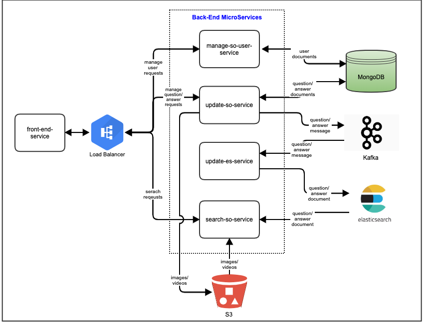

# My Stack Overflow
Designing and implementation of a competitor of [Stack Overflow](https://stackoverflow.com/).

## Use cases:

1) Top questions are to be shown in the home page

2) Users can create a profile

3) Users can post a question, tag a question

4) Users can answer to a question. Rich media content (photos/videos) can be added as an answer.

5) Users can answer to an answer.

6) Users can vote to an answer or question

7) User can search the tags and browse the questions by tags

8) Users can search questions/answers by text.

## Assumptions

1) Top questions are sorted by latest update and are limited to top 50 questions.

2) No provision for API security.

3) Tags are created while posting question. 

4) Only tag names are supported not tag description.

5) User searches are not supported.

## High Level Design



## Micro Services

### manage-so-user-service
* Manages user registration and other user admin flow via REST endpoints.
* Stores the user profile details in mongodb.

### update-so-service
* Exposes REST endpoints to post, update and delete questions and answers.
* Exposes REST endpoints to upload images and videos for answers.
* Persists the questions and answers in mongodb.
* Persists the images and videos to AWS S3 bucket.
* Publishes message to kafka topics for any change in questions and answers.

### update-es-service
* Consumes messages from kafka topics published by update-so-service.
* Updates the elasticsearch indexes for questions and answers.

### search-so-service
* Searches questions in elasticsearch index based on:
   * Question id.
   * Tags.
   * Question title and description text.
* Searches answers in elasticsearch index based on:
   * Answer id.
   * Parent answer id.
   * Answer text.
* Searches tags based on tag text.   
* Accesses AWS S3 bucket to fetch the images an videos for the answers.

### front-end-service
* Provides user interface to:
  * Create user profiles.
  * Post questions and answers.
  * Search questions and answers by text.
  * Search tags.
  * Search questions by tags.
  * Vote for question and answers.
  * Upload images and videos for the answers.
  
# Technology Stack

## Spring Boot
To create MicroServices in Spring.

## MongoDB
To persist questions and answers.

## Apache Kafka
To publish and consume updates for questions and answers to update them in elasticsearch.

## Elasticsearch
To create search indexes for questions and answers and fast and efficient search results.

## AWS S3
To store static contents such as images and videos for answers.

## nginx
To enable load balancing and routing for all the microservices.

## ReactJS (Not finalized)
To create user interface.

# Datastore choice - NoSQL
Chose NoSql database MongoDB to persist the data as its a document based NoSql which provides fast storage and retrieval of documents and it scales efficiently.

# Datastore Design
## User
```json
{
    "userId": "string",
    "emailId": "string",
    "password": "secretString",
    "displayName": "string"
}
```

## Question
```json
{
    "questionId": "string",
    "questionTitle": "string",
    "questionDescription": "string",
    "tags": ["string","string"],
    "voteCount": "long",
    "createTimestamp": "long",
    "updateTimestamp": "long",
    "postedBy": "string"
}
```

## Answer
```json
{
    "answerId": "string",
    "questionId": "string",
    "answerText": "string",
    "parentAnswerId": "string",
    "voteCount": "long",
    "createTimestamp": "long",
    "updateTimestamp": "long",
    "postedBy": "string",
    "imageUrls": ["string","string"],
    "videoUrls": ["string","string"]
}
```

# Critical APIs

* API to search questions and answers by text.
* API to search questions by tag.
* API to search tags. 